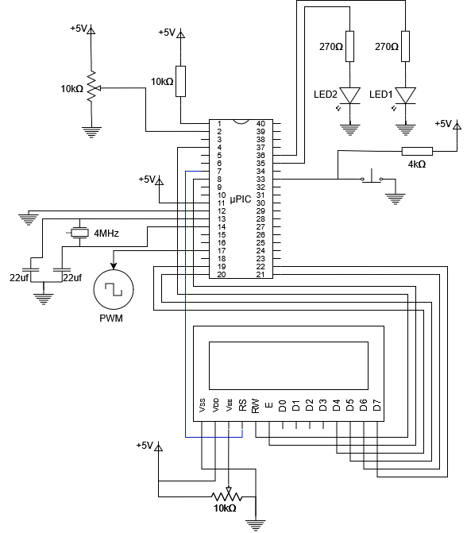

# PWM_PIC16F877
Este proyecto genera una señal PWM controlada por la lectura de voltaje de un potenciometro. Así también, es capaz de generar dos modos de señal PWM (Lineal y Cnetrado) mediante la pulsación de un botón. En la pantalla LCD se muestran los valores del voltaje leido así como del DutyCycle.

## Circuito



## Demostración de funcionamiento


## Especificaciones de Hardware

- Frecuencia de oscilacion: 4MHz
- 8 bits para la conversion ADC (se usan los 8 bits justificados a la izquierda ubicados en ADRESH en lugar de los 10 bits del ADC)
- Reloj de oscilacion externo

## Modulos empleados

- Timer 1
- Timer 2
- CCP1
- CCP2
- Conversor ADC

## Cálculos previos

### Cálculo del CCP2

Se emplea el CCP2 para lanzar una conversión ADC cada 100ms, ya que según el datasheet este es el único módulo CCP que puede lanzar evento de conversión.

$$
T = \frac{4\cdot TMR1prescaler\cdot CCPR2}{F_{osc}}
$$

Dado que se emplea un prescaler en el TMR1 de 1:8, un reloj externo de 4MHz, se llega a que el valor de CCPR2 es 12500.

### Cálculo del CCP1

Para llegar a una señal PWM de frecuencia 100KHz, y empleando el TMR2 con prescaler 1:1, se emplea la siguiente fórmula:

$$
PWM_T = \frac{4\cdot TMR2prescaler\cdot (PR2+1)}{F_{osc}}
$$

Donde se obtiene el valor de PR2 es de 9.

Para el control del DutyCycle (DC) se hace a partir de:

$$
PWM_{DC} = \frac{TMR2prescaler\cdot (CCP1:CCP1CON[5:4])}{F_{osc}}
$$

Sabiendo que el DC máximo que se puede llegar (al 100%) es cuando $$PWM_{DC} = PWM_T$$. Esto nos lleva a que el máximo valor de CCP1:CCP1CON[5:4] es 40.
Entonces CCP1:CCP1CON[5:4] solo puede tomar valores de 0 a 40, por lo que se lo vincula con la conversión ADC con la siguiente ecuación:

$$
CCP1:CCP1CON[5:4] = \frac{ADRESH \cdot 40}{256}
$$

La razón por la cual se divide entre 256 y no por 1023 como debería ser es porque se están empleando los 8 primeros bits del registro de conversión ADRES de 10 bits justificados a la izquierda. Esto hace que el número obtenido en ADRESH sea el valor de la conversión ADC dividido entre 4, y $$4\cdot256=1024\approx1023$$; lo cual hace que la fórmula anterior sea válida.

### Cálculo del voltaje

Aplicando la mísma lógica anterior, y sabiendo que el valor del voltaje se encuentra comprendido entre 0 y 5, se procede a aplicar la siguiente formula para obtener un voltaje en unidades de decivoltios:

$$
V = ADRES\frac{50}{256}
$$

### Cálculo del DutyCycle


---
## Pseudocódigo

### Configuración
```text
//Configuración de los fusibles
Oscilador externo de 4MHz
WDT desactivado
Brownout desactivado

//Variables globales
modo (entero)
modo ← 0

//Configuracion de pines
Definición de los pines del LCD
RB0 y RA0 entradas
RB2, RB3 y RC2 salidas
B2 ← 0
B3 ← 0
A0 entrada analogica

//Configuracion del conversor analógic0
Datos justificados a la izquierda para usar solo 8 bits de resolución
A0 como canal analogico
Frecuencia de conversion analógica Fos/8
Encender módulo analógico

//Configuracion CCP2
Modo comparacion con reseteo del TMR1 y evento ADC
CCPR2 ← 12500

//Configuracion CCP1
Modo PWM

//Configuracion del TMR1
Prescaler 1:8
Fuente de reloj interna
Encender TMR1

//Configuracion del TMR2
Prescaler 1:1
PR2 ← 9

//Configuracion de las interrupciones
Habilitar interrupciones globales
Habilitar interrupciones por interrupción externa en RB0
```
### Programa principal

```text
Inicializar LCD
while(1)
	si(¿flag ADC esta en 1?):
		limpiar flag ADC
		v ← ADRESH*50/256 			//Cálculo de decivoltios para display
		si(modo==0):
			RB3 ← 1
			Escribir en la primera línea de la LCD: "Modo Lineal"
			dc ← ADRESH*40/256		//Cálculo del dutycycle
			CCP1:CCP1CON[5:4] ← dc
			dc100 ← ADRESH*100/256	//Cálculo del dutycycle en 100% para display
		sino:
			RB3 ← 0
			Escribir en la primera línea de la LCD: "Modo Centrado"
			diferencia ← 0
			si(ADRESH>=128):		//128 es el valor digital para 2.5v
				RB2 ← 1
				diferencia ← ADRESH-128
			sino:
				RB2 ← 0
				diferencia ← 128-ADRESH
			dc ← diferencia*40/128		// la ecuación es DC = abs(ADRESH-128)*(40-0)/(256-128)
			CCP1:CCP1CON[5:4] ← dc
			dc100 ← diferencia*100/128	// la ecuación es DC% = abs(ADRESH-128)*(100-0)/(256-128)
		Escribir en la segunda línea de la LCD: "Voltaje: %v DutyCyle: %dc100"
```

### Interrupción externa

```text
esperar 20ms
si(RB0 esta precionado)
	modo ← modo + 1
```

---
## Código

### Main
```c
#include "source.h"
#include "funciones.h"

int modo = 0;

int main(){
   configuracion();
   mensaje();
   while(1){
      if(bit_test(PIR1,6)){	//Si hubo una conversión ADC
	 bit_clear(PIR1,6);	//Se limpia flag de conversion ADC
	 mensaje();
      }
   }
   return 0;
}
```

### Funciones
```c
#include "source.h"
#include "funciones.h"

#define LCD_ENABLE_PIN  PIN_E0                                    ////
#define LCD_RS_PIN      PIN_A5                                    ////
#define LCD_RW_PIN      PIN_A2                                    ////
#define LCD_DATA4       PIN_D0                                    ////
#define LCD_DATA5       PIN_D1                                    ////
#define LCD_DATA6       PIN_D2                                    ////
#define LCD_DATA7       PIN_D3 

#include <lcd.c>

extern int modo;

void configuracion(){
   //Configuracion de pines
   lcd_init();
   delay_ms(10);
   trista |= 0b00000001;	//RA0 como entrada
   tristb |= 0b00000001;	//RB0 como entrada
   tristb &= 0b11110011;	//RB2 y RB3 como salidas
   tristc &= 0b11111011;	//RC2 como salida
   output_low(PIN_B2);
   output_low(PIN_B3);
   //Configuracion ADC
   ADCON0 = 0b01000001;		//Frecuencia de conversion Fosc/8, RA0 como canal analógico y activacion del módulo ADC
   ADCON1 = 0b00001110;		//Justificado a la izquierda y Ansel
   //Configuracion del CCP2 con prescaler de 1:8 y reloj de 4MHz para lanzar conversion ADC cada 100ms
   CCPR2L = 12500 & 0xFF;
   CCPR2H = 12500>>8;
   CCP2CON = 0b00001011;	//CCP2 con modo comparador con evento ADC
   T1CON = 0b00110001;		//Prescaler 1:8, TMR1 activado
   //Configuracion del CCP1 para prescaler de 1:1, reloj de 4MHz y modo PWM
   PR2 = 9;			//Frecuencia PWM de 100KHz
   CCP1CON = 0b00001111;	//Modo PWM
   T2CON = 0b00000100;		//Prescaler 1:1, postcaler 1:1, y TMR2 activado
   //Configuracion de las interrupciones
   OPTION_REG = 0b00000000;	//Desactivacion de las resistencias pull-ups, e interrupcion externa por flanco de bajada
   INTCON = 0b10010000;		//Activacion de las interrupciones globales y por interrupcion externa RB0
}

int dc, dc100, v, ccbits;
const int mask1 = 0b11001111, mask2 = 0b00000011;

void mensaje(){
   v = (ADRESH>>3)+(ADRESH>>4)+(ADRESH>>7);	//Operacion equivalente a ADRES*50/255
   if(modo==0){
      output_high(PIN_B3);
      lcd_gotoxy(1,1);
      lcd_putc("Modo Lineal  ");
      dc = (ADRESH>>3)+(ADRESH>>5);		//Operacion equivalente a ADRES*40/255
      dc100 = (ADRESH>>2)+(ADRESH>>3)+(ADRESH>>6);	//Operacion equivalente a ADRES*100/255
      ccbits = dc & mask2;
      ccbits = ccbits<<4;
      CCP1CON = (CCP1CON & mask1)|ccbits;
      CCPR1L = dc>>2;
   }else{
      output_low(PIN_B3);
      lcd_gotoxy(1,1);
      lcd_putc("Modo Centrado");
      int diferencia;
      if(ADRESH>=128){
	 output_high(PIN_B2);
	 diferencia = ADRESH-128;
      }else{
	 output_low(PIN_B2);
	 diferencia = 128-ADRESH;
      }
      dc = (diferencia>>2)+(diferencia>>4);			//Operacion equivalente a diferencia*40/128
      dc100 = (diferencia>>1)+(diferencia>>2)+(diferencia>>5);	//Operacion equivalente a diferencia*100/128
      ccbits = dc & mask2;
      ccbits = ccbits<<4;
      CCP1CON = (CCP1CON & mask1)|ccbits;
      CCPR1L = dc>>2;
   }
   lcd_gotoxy(1,2);
   lcd_putc("V: ");
   lcd_putc(v/10+'0');
   lcd_putc('.');
   lcd_putc(v%10+'0');
   printf(lcd_putc, "v D: %03d%%", dc100);
}

#INT_EXT
void interrupcion(){
   delay_ms(20);			//Filtro anti-rebotes
   if(!bit_test(PORTB,0)){
      modo++;
      modo%=2;
   }
}
```
