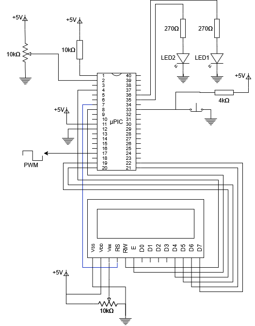
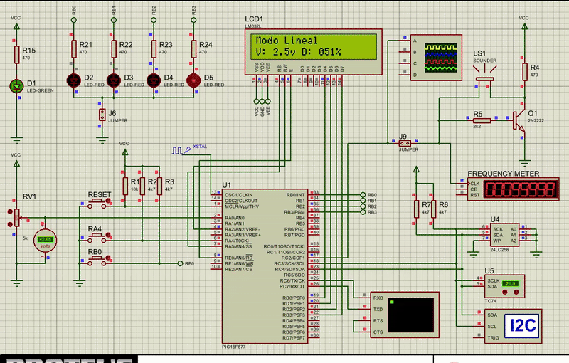

# PWM_PIC16F877
Este proyecto genera una señal PWM controlada por la lectura de voltaje de un potenciometro. Así también, es capaz de generar dos modos de señal PWM (Lineal y Cnetrado) mediante la pulsación de un botón. En la pantalla LCD se muestran los valores del voltaje leido así como del DutyCycle.

## Circuito



## Demostración de funcionamiento



## Especificaciones de Hardware

- Frecuencia de oscilacion: 8MHz
- 10 bits para la conversion ADC
- Reloj de oscilacion interno

## Modulos empleados

- Timer 1
- Timer 2
- CCP2
- Comparador Analógico
- Conversor Analógico

## Cálculos previos

### Cálculo del CCP2

Cargar CCPR2 para lanzar una conversión analógica cada 100ms.

$$
T = \frac{4\cdot PRESCALER\cdot CCPR2}{F_{osc}}
$$

Dado que se emplea un prescaler de 1:16, un reloj interno de 8MHz, se llega a que el valor de CCPR2 es 50000.

### Cálculo del TMR2

TMR2 debe llegar a hacer match con PR2 en un tiempo de 27.776ms repitiendose esto 18 veces para llegar a 499.968ms (muy cercano a los 500ms de duracion del encendido y apagado durante el parpadeo).

$$
T = \frac{4\cdot PRESCALER \cdot POSTCALER \cdot (PR2+1)}{F_{osc}}
$$

Trabajando con un prescaler y postcaler de 1:16 ambos, se llega a que el valor de PR2 es de 216.

### Cálculo del voltaje

Sabiendo que el valor de 0v corresponde al valor digital de 0, y que 5v corresponde a 1023, se procede a aplicar la siguiente formula para obtener un voltaje en unidades de centivoltios:

$$
V = ADRES\frac{500}{1023}
$$

Sin embjargo, en C esto consume mucha memoria, por lo que aplicando desplazamiento en bits se llega a:

$$
V = (ADRES>>1)-(ADRES>>6)+(ADRES>>8)
$$

Para la conversión se seleccionó una frecuencia de Fosc/16. Debido a que según el datasheet el $T_{AD}$ debe de ser de almenos 1.6us. Y al usarse un reloj interno de 8MHz se obtiene:

$$
T_{AD}= \frac{16}{F_{OSC}}=2us
$$

---
## Pseudocódigo

### Configuración
```text
//Configuración de los fusibles
Oscilador interno
WDT desactivado
Brownout desactivado
ADC de 10 bits
Reloj de 8MHz

//Variables globales
cont1 y cont2 (enteros)
cont1 ← 0
cont2 ← 0

//Configuracion de pines
PORTD salida (Pines del LCD)
B0 entrada
B2 y B3 salidas
B2 ← 0
B3 ← 0
A0 y A3 entradas analogicas

//Configuracion del conversor analógic0
Datos justificados a la derecha
A0 como canal analogico
Frecuencia de conversion analógica Fos/16
Encender módulo analógico

//Configuración del comparador analógico
A0 entrada inversora del opamp
A3 entrada noinversora del opamp
C1 //Bit del registro que es 1 si A0 < A3 y es 0 si A0 > A3
//Configuracion CCP2
Modo comparacion con reseteo del TMR1 y evento ADC
CCPR2 ← 50000

//Configuracion del TMR1
Prescaler 1:4
Fuente de reloj interna
Encender TMR1

//Configuracion del TMR2
Prescaler 1:16
Postcaler 1:16
PR2 ← 216

//Configuracion de las interrupciones
Habilitar interrupciones globales
Habilitar interrupciones por perifericos
Habilitar interrupcion por TMR2
```
### Programa principal

```text
Inicializar LCD
si(C1)	//Bit del registro del comparador analogico que es 1 si A0 < A3 y es 0 si A0 > A3
	Escribir: "Aumentar tension"
	B3 ← 0
sino
	Escribir: "Bajar tension"
	B3 ← 1
while(1)
	si(B0==0)
		B2 ← ~B2
		Encender TMR2
	si(Flag ADC)
		Limpiar Flag ADC
		v = ADRES*5/1023
		Escribir: "Tension: {v} V"
	si(Flag comparador)	//Hay un flag cada vez que la salida del opamp tiene un cambio
		Limpiar flag comparador
		si(C1)
			Escribir: "Aumentar tension"
			B3 ← 0
		sino
			Escribir: "Bajar tension"
			B3 ← 1
```

### Interrupción por TMR2

```text
cont1 ← cont1 + 1
si(cont1 es 18)
	cont1 ← 0
	cont2 ← cont2 + 1
	B2 ← ~B2
	si(cont2 es 5)
		cont2 ← 0
		Apagar TMR2
```

---
## Código

### Main
```c
#include "source.h"
#include "funciones.h"

int modo = 0;

int main(){
   configuracion();
   mensaje();
   while(1){
      if(bit_test(PIR1,6)){
	 PIR1 &= 0b10111111;
	 mensaje();
      }
   }
   return 0;
}

```

### Funciones
```c
#include "source.h"
#include "funciones.h"

#define LCD_ENABLE_PIN  PIN_E0                                    ////
#define LCD_RS_PIN      PIN_A5                                    ////
#define LCD_RW_PIN      PIN_A2                                    ////
#define LCD_DATA4       PIN_D0                                    ////
#define LCD_DATA5       PIN_D1                                    ////
#define LCD_DATA6       PIN_D2                                    ////
#define LCD_DATA7       PIN_D3 

#include <lcd.c>

extern int modo;

void configuracion(){
   lcd_init();
   delay_ms(10);
   trista |= 0b00000001;
   tristb |= 0b00000001;
   tristb &= 0b11110011;
   tristc &= 0b11111011;
   output_low(PIN_B2);
   output_low(PIN_B3);
   //Configuracion ADC
   ADCON0 = 0b01000001;
   ADCON1 = 0b00000100;
   //Configuracion del CCP1 para prescaler de 1:8 y reloj de 4MHz
   CCPR2L = 12500 & 0xFF;
   CCPR2H = 12500>>8;
   CCP2CON = 0b00001011;	//CCP1 con modo comparador con evento ADC
   T1CON = 0b00110101;
   //Configuracion del CCP2 para prescaler de 1:1, reloj de 4MHz y modo PWM
   PR2 = 9;
   CCP1CON = 0b00001111;
   T2CON = 0b00000100;
   //Configuracion de las interrupciones
   OPTION_REG = 0b00000000;
   INTCON = 0b10010000;
}

int dc, dc100, v, ccbits;
const int mask1 = 0b11001111, mask2 = 0b00000011;

void mensaje(){
   v = (ADRES>>3)+(ADRES>>4)+(ADRES>>7);	//Operacion equivalente a ADRES*50/255
   if(modo==0){
      output_high(PIN_B3);
      lcd_gotoxy(1,1);
      lcd_putc("Modo Lineal  ");
      dc = (ADRES>>3)+(ADRES>>5);		//Operacion equivalente a ADRES*40/255
      dc100 = (ADRES>>2)+(ADRES>>3)+(ADRES>>6);	//Operacion equivalente a ADRES*100/255
      ccbits = dc & mask2;
      ccbits = ccbits<<4;
      CCP1CON = (CCP1CON & mask1)|ccbits;
      CCPR1L = dc>>2;
   }else{
      output_low(PIN_B3);
      lcd_gotoxy(1,1);
      lcd_putc("Modo Centrado");
      int diferencia;
      if(ADRES>=128){
	 output_high(PIN_B2);
	 diferencia = ADRES-128;
      }else{
	 output_low(PIN_B2);
	 diferencia = 128-ADRES;
      }
      dc = (diferencia>>2)+(diferencia>>4);			//Operacion equivalente a diferencia*40/128
      dc100 = (diferencia>>1)+(diferencia>>2)+(diferencia>>5);	//Operacion equivalente a diferencia*100/128
      ccbits = dc & mask2;
      ccbits = ccbits<<4;
      CCP1CON = (CCP1CON & mask1)|ccbits;
      CCPR1L = dc>>2;
   }
   lcd_gotoxy(1,2);
   lcd_putc("V: ");
   lcd_putc(v/10+'0');
   lcd_putc('.');
   lcd_putc(v%10+'0');
   printf(lcd_putc, "v D: %03d%%", dc100);
}

#INT_EXT
void interrupcion(){
   delay_ms(20);
   if(!bit_test(PORTB,0)){
      modo++;
      modo%=2;
   }
}
```
